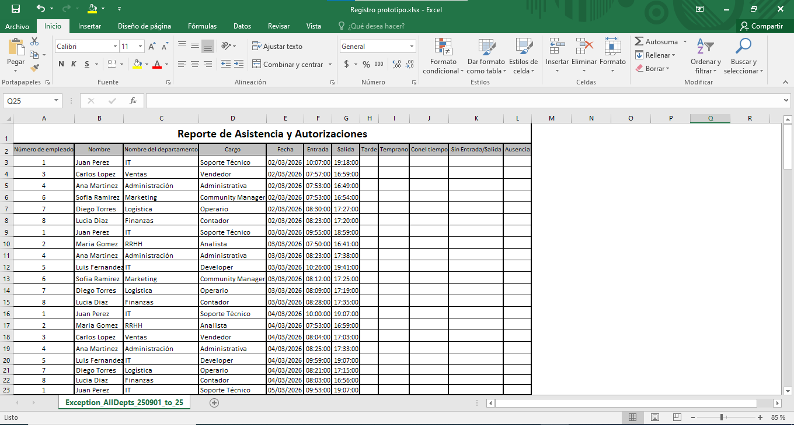
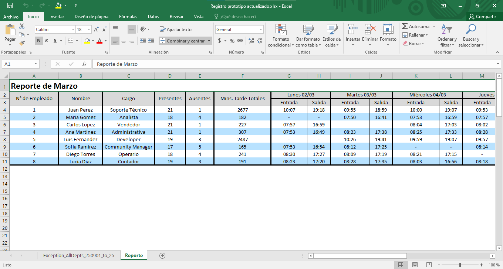

# 📊 Sistema de Asistencia de Empleados

Aplicación desarrollada en Python para automatizar el procesamiento de registros de asistencia provenientes de múltiples depósitos, unificando la información y generando reportes consolidados en Excel.

---

## 🚀 Funcionalidades

- 📥 Carga de archivos Excel mediante interfaz gráfica (Drag & Drop o selección manual)
- 🔄 Integración de datos de múltiples fuentes
- 🧹 Normalización de registros de asistencia
- 📊 Cálculo automático de:
  - Presentes
  - Ausentes
  - Minutos de tardanza
- 📑 Generación de reportes estructurados en Excel
- 🖥️ Interfaz gráfica amigable para usuarios no técnicos

---

## 🧠 Problema que resuelve

En entornos con múltiples depósitos, los registros de asistencia se encuentran fragmentados, generando inconsistencias en los datos.

Este sistema permite:
- Centralizar la información
- Evitar duplicados
- Mejorar la confiabilidad de los reportes

---

## 🛠️ Tecnologías utilizadas

- Python
- openpyxl (manejo de Excel)
- Tkinter + TkinterDnD (interfaz gráfica)
- Pillow (manejo de imágenes)

---

## 🧪 Testing y validación

- Validación manual de datos generados
- Comparación entre registros originales y procesados
- Detección de inconsistencias en entradas y salidas
- Verificación de reglas de negocio (tardanzas, ausencias, etc.)

---

## 📸 Capturas

### Interfaz de usuario


### Registro original


### Resultado generado


---

## 📂 Ejemplo de uso

1. Ejecutar la aplicación:
```bash
python src/main.py
```
2.Cargar un archivo Excel desde:
-Drag & Drop
-Selección manual
El sistema generará automáticamente un nuevo archivo con el reporte procesado.

---

## 📁 **Archivo de ejemplo**

Se incluye un archivo de prueba en:

**ejemplo/registro_ejemplo.xlsx**

Y el archivo en .exe para poder realizar la prueba o el uso de la aplicación en:

**ejemplo/unificar_excel.py**

---

## 🔧 **Mejoras futuras**
Eliminación de variables globales
Manejo avanzado de errores
Configuración flexible del formato de entrada
Optimización de estructuras de datos
Implementación de testing automatizado

---

## 👤 **Autor**

Agustín Cardozo - Estudiante de Ingeniería en Sistemas de Información (UTN)
